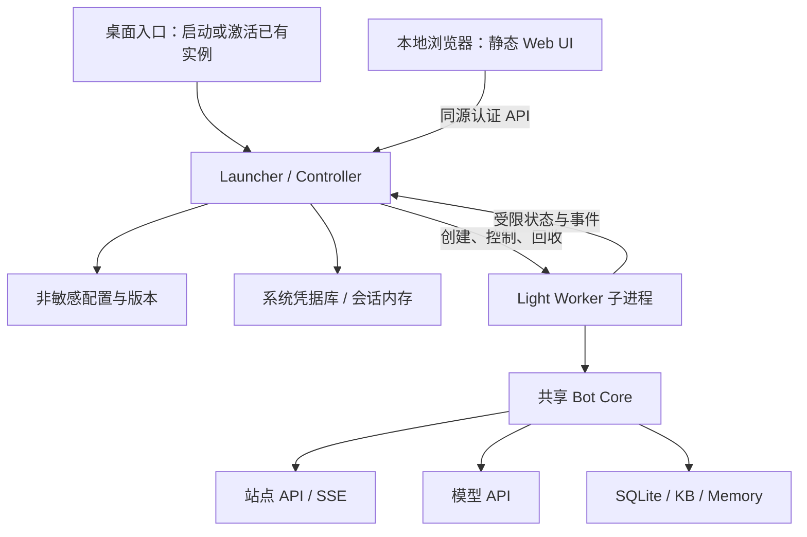
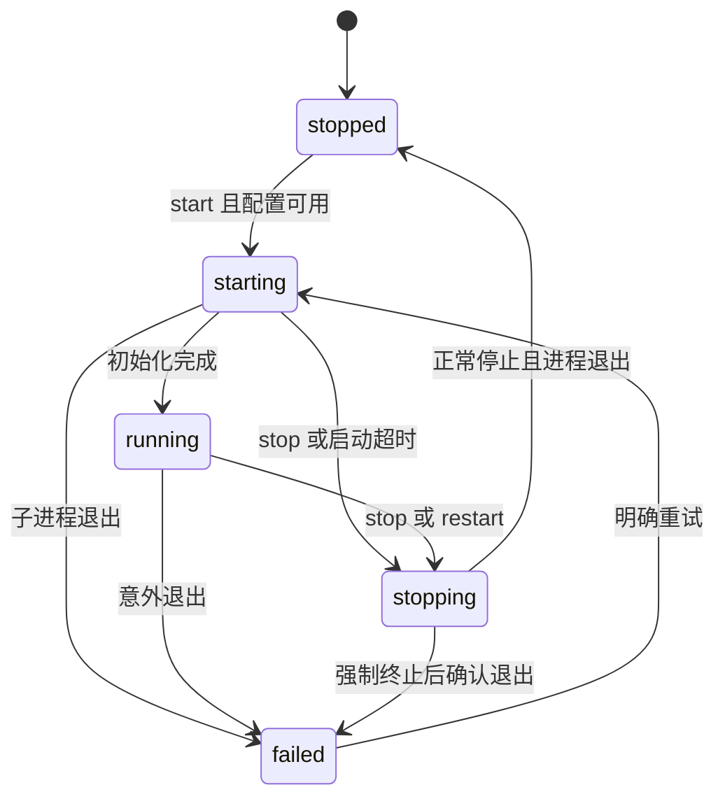

# Raricy Bot Light 发行版设计

状态：设计基线；L0–L5 均已实现（2026-09-23，`light-edition` 分支）：平台原型、导入解耦、
配置/凭据、控制面、管理页与冻结发行均已落地，**干净 Windows 验收与真实站点/模型验收
未执行**。日期：2026-09-23。

本文记录本次讨论确认的产品方向与建议实施方案，**不表示 Light 已经存在或完成验收**。
现有完整版继续以 [内部契约](INTERFACES.md)、[决策记录](DESIGN_DECISIONS.md) 和源码为准。
本文中的新增模块、接口、状态与默认策略均为拟议设计；现有字段与默认值链接源码，不另抄一份配置规范。

## 1. 目标、已确认范围与首版选择

### 1.1 已确认的产品方向

1. 保留现有完整版及其 MCP、CLI、服务器部署能力，另提供独立 Light 发行版。
2. Light 保留聊天、图片理解、评论、本地知识库、长期记忆；不提供 MCP / Tool Calling。
3. 普通用户不需要编辑 YAML、手动设置环境变量，或安装 Python、Node、Docker。
4. 首次通过本地 Web 向导填写账号和模型配置；保存后可启动机器人。
5. 后续启动可自动读取配置，在后台静默运行，不出现终端窗口。
6. 关闭浏览器不停止机器人；用户能重新打开管理页并明确停止或退出。
7. 共用成熟核心，控制层单向依赖核心；核心不依赖 GUI。

“即开即用”指发行包包含所需运行时、首次配置可在界面完成。站点账号、模型服务、网络和
可用额度仍由用户提供，不意味着首次启动无需任何信息，也不内置共享 API Key。

### 1.2 本设计建议采用的首版范围

以下是为收敛实现而选定的工程基线，不是对现有产品能力的声明：

| 项目 | 首版选择 |
|---|---|
| 平台 | Windows 桌面 x64；其他平台保留抽象边界，完成平台验收后再发布 |
| 使用者 | 当前操作系统用户，本机管理 |
| 实例 | 一个活动账号、一个 Bot 子进程，不做多实例控制台 |
| 界面 | Svelte + Vite 静态前端，Python Controller 同源提供资源 |
| 控制服务 | FastAPI + Uvicorn，单进程、单 worker，无开发期 reload |
| 发行 | 自包含目录式应用，先提供 ZIP；安装器作为后续交付形式 |
| 启动 | 首次自动打开向导；配置完成后，普通启动静默运行 |
| 管理入口 | 再次双击打开已有管理页；另提供“打开管理页”快捷入口 |
| 托盘、登录自启动 | 后续增强，首版不作为后台运行的前提 |
| 定时发文 | 完整版保留；Light 首版禁止启用，不提供配置界面 |
| 自动更新 | 首版手动升级；不在后台下载并执行新程序 |

Windows 最低版本与具体依赖锁定版本由打包阶段根据 Python、打包工具及实际测试确定，
发布说明只能列出实测平台。不能把“代码可导入”当作跨平台发行验收。

### 1.3 非目标

- 不修改站点，不新增未经契约确认的站点调用。
- 不复制一套聊天、配额、记忆或数据库业务代码长期分叉维护。
- 不提供公网管理、多租户、远程任意路径读写、通用脚本执行或插件市场。
- 不把 GUI 做成全量 YAML 编辑器，不允许用户从界面启用隐藏 MCP 功能。
- 不在首版 GUI 管理、导出或直接编辑站内用户的私有记忆正文。
- 不承诺电脑关机、睡眠或断网时继续响应；全天运行仍适合服务器部署。

## 2. 当前代码事实与约束

| 已核实的事实 | 代码或契约依据 | 对 Light 的影响 |
|---|---|---|
| 入口读取配置后运行 `BotApp`，安装停止信号处理 | [CLI](../../src/raricy_bot/__main__.py)、[App](../../src/raricy_bot/app.py) | 可以复用生命周期，但需适配桌面进程控制 |
| 完整配置类名是 `Config`，包含 `Secrets` | [config.py](../../src/raricy_bot/config.py) | 不得直接序列化返回给 Web |
| `load_config()` 同时读取文件、校验、处理路径和取环境凭据 | 同上 | 需拆出可复用的非敏感配置校验 |
| `mcp` 是基础依赖，App 和 worker 存在直接导入 | [pyproject.toml](../../pyproject.toml)、[worker.py](../../src/raricy_bot/core/worker.py)、[MCP 包入口](../../src/raricy_bot/mcp/__init__.py) | 关闭开关不足以移除依赖 |
| 发文生成也使用工具协议，已有无工具路径 | [writer.py](../../src/raricy_bot/blog/writer.py)、D-106–D-110、D-116 | 解耦时必须保护完整版发文语义 |
| `/kb` 是本地检索，不经过 MCP | [KB](../../src/raricy_bot/kb/service.py)、[能力表](../../src/raricy_bot/capabilities.py) | 保留能力声明、权限与当前轮上下文边界 |
| 记忆撰写使用普通模型调用并解析受限结果 | [memory/writer.py](../../src/raricy_bot/memory/writer.py) | 去掉 Tool Calling 不要求删除记忆 |
| 探针只提供有限健康信息 | [ops.py](../../src/raricy_bot/ops.py)、`BotApp.ready/live` | 不能从 readyz 推导模型、KB、记忆均正常 |
| 记忆为单进程单写者 | D-59、D-115 | 必须防止两个入口同时占用同一数据集 |
| DB、KB、记忆与归档、稿库的相对路径基准不完全相同 | [config.py](../../src/raricy_bot/config.py) | Light 使用明确的应用数据路径，不继承启动目录 |
| 配置、测试、知识库等部分目录被 Git 忽略 | [.gitignore](../../.gitignore) | 发行和 CI 不得假设本地文件一定随仓库存在 |

必须继续保持消息去重、恢复水位、配额结算、历史送达后提交、公开/私有记忆隔离、
用户数据不插入 system，以及正文与凭据不进入日志和 SQLite 的现行边界。
Light 的“轻量化”不包括简化上述正确性约束。

## 3. 总体架构与职责



### 3.1 Web UI

负责向导、Simple / Advanced 配置、字段错误、测试结果、启停、待生效提示和近期事件。
不接触 YAML 文件路径、不保存密码到浏览器存储、不直接调用站点或模型接口。
所有资源随发行包提供，不依赖 CDN、远程字体、第三方统计或运行期 Node 服务。

### 3.2 Launcher / Controller

负责本机访问控制、配置事务、凭据管理、单实例激活、进程状态机、子进程控制、状态聚合和事件缓冲。
只通过配置服务、核心公开生命周期以及受限 IPC 使用 Core，不直接写 Bot 的 SQLite 或记忆 Markdown。
站点/模型测试复用核心传输与校验，不创建第二个 Bot 或 SSE 消费者。

### 3.3 Light Worker

是 Launcher 内部的执行入口：加载固定配置快照、注入 Light 装配策略、持有数据目录锁、
启动 `BotApp`，把私有停止指令转换为 `app.stop()`，输出受限状态与事件。
IPC 与冻结程序启动细节留在适配层，业务模块不 import `raricy_launcher`。

### 3.4 共享 Core 与完整版

源码继续以一份共享实现维护。新增通用接缝只能表达业务能力、生命周期或可观测状态，
不能让 `core/` 根据网页按钮、浏览器会话或 FastAPI 请求分支执行。
完整版继续使用原 CLI 和完整能力装配；Light 选择无工具的能力集合和模型客户端。

## 4. 发行边界与 MCP 解耦

### 4.1 完整版兼容承诺

- 保留现有完整版包名、CLI 用法、配置路径优先级和 Docker 交付。
- 完整版仍可使用 MCP 和定时发文；不能为了 Light 静默删除原有功能。
- 本任务不修改现有部署 `config.yaml`，不启停线上实例。
- 共享重构不得改变模型重试、严格完成检查、权限、配额、取消与恢复语义。

### 4.2 Light 的强制限制

Light 发行包不包含 MCP SDK、Node、MCP Server、工具 schema 实现或可执行的工具调用循环。
配置、装配和打包同时收口：导入旧配置时报告不支持的能力；Light Worker 再验证发行策略；
构建产物检查禁止依赖和模块。不能仅隐藏界面开关或依靠默认 `enabled=false`。

`/search`、`/zhihu`、`/map`、`/wolfram` 不作为可执行能力注册，也不出现在普通帮助中。
为避免旧用户误以为工具真的执行，这四个历史命令可在路由的本地拒绝表中返回固定
“Light 不支持该命令”提示，不触发模型或网络工具，不把其内容当普通聊天发送。
该拒绝表不是能力注册表，不引入 schema、权限或工具执行路径。
`/kb` 保留在 Light 的本地能力集合中。

### 4.3 最小解耦范围

| 当前位置 | 拟议调整 |
|---|---|
| `mcp/__init__.py` 的集中导入 | 完整版模块入口去除不必要的导入副作用；基础模块不经它取公共类型 |
| `core/worker.py` | 普通模型调用与调度保留；工具协议、工具响应解析和两轮调用实现移入完整版工具客户端 |
| `mcp.contracts` 中的通用计时/诊断 | 真正被普通调用使用的部分移入无 MCP 依赖的中立模块 |
| `capabilities.py` | 本地能力与完整版工具声明分离；Router、help、校验消费同一装配结果 |
| `config.py` | 保留公共配置校验入口，将 MCP 专属解析与类型隔离到完整版可选模块 |
| `app.py` | 注入能力服务/工厂；Light 使用无工具实现，避免顶层导入完整版 MCP 与发文实现 |
| `blog/writer.py` | 完整版继续取得工具客户端，保留无工具生成与严格输出检查 |
| `texts.py` | Light 帮助与不可用提示按发行能力生成，不复制完整帮助形成两套事实 |

拟议文件名在实现阶段确定；以依赖方向与行为测试作为验收，不为整理目录进行无关重构。
工具类型若只服务完整版，就随工具实现移动，不以“公共合同”为名保留到 Light。

### 4.4 两种产物、一份源码

首版建议保留根 `pyproject.toml` 作为完整版构建入口，增加 `packaging/light/` 构建描述。
Light 构建脚本把明确允许的共享模块、Launcher 和静态资源放入临时 staging 目录后构建；
不复制并长期维护另一份源码，不通过字符串替换修改业务文件。

Light 的 Python 构建元数据可使用独立发行名 `raricy-bot-light`，但因与完整版共享
`raricy_bot` 导入命名空间，**两者不得安装到同一 Python 环境**。面向用户交付的是独立应用目录；
开发和 CI 也使用独立环境。将来是否拆成多个可共装的 wheel，不是首版前置条件。

完整版与 Light 配置、日志、数据目录隔离，但同一账号不能因此视为可以同时消费同一站点流；
本机账号互斥及其限制见 §9.5。

## 5. 用户流程与配置界面

界面视觉方向已确认为深色科幻风格（霓虹强调色、等宽字体、全部资源本地打包）；
L0 的占位管理页 `raricy_launcher/static/index.html` 已确立该基调，L4 在其上扩展。

### 5.1 首次启动

1. 初始化当前用户的数据目录、单实例守卫和仅回环监听的 Controller。
2. 打开带一次性引导凭证的本地向导；此时不启动 Bot、不访问站点、不调用模型。
3. 填写站点账号、密码、模型 API 地址、模型名称和 API Key；提供受维护的 System Prompt 默认模板。
4. 用户点击“测试站点”“测试模型”时分别测试；网络失败不阻止保存草稿。
5. 选择可选能力及其访问范围；图片理解不能仅凭模型名称自动打开。
6. 明确保存凭据方式；无持久凭据库时可选择仅本次运行。
7. 点击“保存并启动”：先提交配置事务，再启动对应版本；启动失败保留已保存配置并显示原因。

默认保留纯聊天最小路径；Vision、Comments、Memory、KB 未经选择不自动打开。
站点登录只能证明账号身份；测试还应区分聊天权限，不能把 auth/me 成功当成可聊天。
向导说明第三方模型处理、记忆存储和图片外送事实，沿用现有隐私边界。

### 5.2 后续启动、关闭和再次打开

| 用户动作 | 明确行为 |
|---|---|
| 已配置后首次双击，Controller 尚未运行 | 默认读取配置并启动 Bot，不弹终端、不自动弹浏览器 |
| 未完成配置或凭据不可用时双击 | 打开向导/修复页，Bot 不启动 |
| Controller 已运行时再次双击 | 激活已有实例并打开管理页，不创建新 Bot；已手动停止的 Bot 不擅自重启 |
| 点击“打开管理页”快捷入口 | 确保 Controller 存在并打开页面，按明确启动偏好决定是否启动 Bot |
| 关闭浏览器 | Controller 和 Bot 保持运行 |
| 点击“停止机器人” | 停止 Bot，Controller 和管理页保留 |
| 点击“重启机器人” | 旧进程退出后，以指定的已保存版本启动新进程 |
| 点击“退出 Light” | 停止 Bot、关闭 Controller、使浏览器会话失效；页面显示已退出 |

`start_bot_on_launch` 首次完成向导后默认开启，可在界面关闭。
它只控制新的 Launcher 会话，不代表系统登录自启动，也不覆盖当前会话中的手动停止。
已配置静默启动失败时，首版打开一次故障页；持续的暂时断网不重复弹窗。
浏览器启动失败须提供受控本地错误提示和重新打开入口，不能输出凭据或原始异常。

### 5.3 Simple / Advanced

| 页面 | 内容与约束 |
|---|---|
| Simple：站点 | 账号、密码配置状态、连接测试；首版固定目标站点，不向普通用户开放任意站点地址 |
| Simple：模型 | API 地址、模型名称、API Key 状态、System Prompt、显式测试 |
| Simple：Vision | 开关与模型需支持图片的说明；不以普通文本测试通过代替视觉验证 |
| Simple：Comments | 开关、行为说明；轮询和配额沿用核心默认值 |
| Simple：KB | 开关、Markdown 导入、加载结果、使用范围；非空资料与权限配置同时检查 |
| Simple：Memory | 开关、允许使用者、共同记忆管理员；解释私有记忆仍有用户侧授权 |
| Advanced：运行 | 上下文、队列、并发、超时、评论轮询、保留周期等经筛选字段 |
| Advanced：诊断 | 日志级别、容量信息、永久错误归档开关与其不自动删除的说明 |
| Advanced：启动 | 打开程序时是否启动 Bot；后续版本才加入登录自启动 |

不提供修改安全硬上限、任意命令、MCP、数据库路径、内部端口或私有记忆目录的通用输入框。
没有表单的高级字段保持原值。UI 标签、帮助和字段绑定可由轻量元数据描述，
但业务校验仍调用配置层，不能在前后端各实现一套不同规则。
模型名称允许手填；首版不依赖所有兼容端点均支持模型列表接口。

## 6. 配置模型、版本与生效

### 6.1 三种对象与唯一校验来源

| 对象（拟议名称） | 用途 | 是否含密钥 |
|---|---|---|
| `EditableConfig` / Web DTO | 明确允许的界面字段、功能设置 | 否 |
| `CredentialUpdate` | 密码/API Key 的保持、替换、删除操作 | 请求内可含，禁止回显 |
| `Config` | Core 的冻结运行配置 | 继续含 `Secrets`，仅内存使用 |

从现有 `load_config()` 拆出“读取 YAML”“非敏感映射解析与校验”“组合凭据”的接缝，
保留原 CLI 入口及其行为。GUI 和 CLI 复用相同字段校验、跨字段限制和 URL 安全策略。
Web DTO 的严格字段白名单独立于旧 CLI 的未知普通字段忽略规则，不借此破坏旧配置兼容。

`GET /api/config` 显式构造响应，不调用 `asdict(Config)`、通用 JSON 编码或对象 repr。
不返回真实密码、API Key、Cookie，也不返回可用于读取凭据的内部定位信息。
运行期派生字段（如 prompt 摘要、临时端口）不作为可编辑字段。

### 6.2 草稿与正式配置

- 草稿：允许缺少尚未填写的必填项，已填写项仍检查类型、范围和安全限制；只保存非敏感字段。
- 正式配置：所有必填项和跨字段规则有效，必要凭据可取得，且符合 Light 能力策略。
- 在线测试：独立于静态校验，不承诺下一次调用仍可用；测试失败不删除有效的本地配置。
- 初次 `config.yaml` 不存在时返回 `needs_setup`，不把正常首次启动报告为程序崩溃。

草稿使用单独的 `draft.yaml` 与自己的 revision，不影响当前运行或正式配置。
自动保存仅限非敏感表单内容；密码不写浏览器 LocalStorage、SessionStorage、草稿或恢复文件。

### 6.3 内部持久化格式

活动档案的 `config.yaml` 保留 Core 可识别的非敏感配置结构，另带 Launcher 专属
`_launcher` 元数据：schema 版本、配置 revision、凭据集合的不透明引用及启动偏好。
Launcher 解析该区后将纯 Core 映射交给公共校验；Core 不依赖 `_launcher`。
真实用户名不是密钥，可以存为账号元数据；传给现有 Core 时仍按既有环境变量契约注入。

引用只是随机标识，不包含密码、密钥摘要或可读账号拼接。具体字段签名由实现后的 schema 定义，
本文不作为第二份可执行配置样例。正式配置与草稿均有体积上限，不超过现有 YAML 读取上限。

### 6.4 配置与凭据的一致提交

配置文件与系统凭据库无法组成普通数据库事务，采用“不可变凭据集合 + 最后切换配置引用”：

1. 取得档案写锁，检查客户端的 `expected_revision`；过期返回冲突，不覆盖其他页面的修改。
2. 合并本次允许字段，保留未提交字段；完成静态校验和 Light 策略校验。
3. 根据 keep / replace / delete 操作，在内存组成新凭据集合，先登记脱敏，再调用凭据后端。
4. 新集合写入新的随机引用并回读确认；此时旧配置与旧凭据仍有效。
5. 同目录写非敏感临时 YAML，flush/fsync 后用原子替换切换 `config.yaml`，包含新 revision 和新引用。
6. 返回新 revision。配置替换失败时仍使用旧版本；新建未引用凭据可清理，不宣称保存成功。
7. 旧凭据只有不再被活动配置、运行实例或保留回退版本引用时才能删除。

配置提交后即使进程在返回 HTTP 响应前崩溃，重新读取配置仍能确定提交结果。
请求超时后前端先读取 revision，不盲目重复删除或替换密钥。
轮换失败、磁盘满、文件被占用、凭据库锁定等路径都必须保留最后一个完整可用版本。
仅内存凭据的引用在 Controller 重启后不可解析，明确进入 `needs_credentials`，不假装已持久保存。

### 6.5 运行版本与重启

首版不做 Core 配置热更新。保存后显示 `saved_revision`、`running_revision` 和 `restart_required`。
启动时在配置锁内取得指定版本快照，生成只含非敏感字段的运行配置文件，再启动 Worker。
凭据从对应集合注入子进程；启动与保存不能拼出“旧模型地址 + 新 Key”的组合。
`restart` 请求绑定目标 revision；操作期间又保存新版本，不自动把目标换成最新版。

失败时保留已保存的新配置并显示失败；允许用户选择旧配置回退。
配置回退不等于回退数据库、记忆或已经产生的站点副作用，也不自动重发消息。
手工修改内部 YAML 不受推荐；检测到未经过服务的内容变化时重新校验并报告冲突，不能静默覆盖。

## 7. 凭据管理

定义 `CredentialStore` 接口，由系统凭据库和会话内存两种实现提供。完整版 CLI 的环境变量方式保留。
桌面默认使用 `keyring` 的系统安全后端；禁止自动选择明文文件后端或在失败时写入 `.env`。
Linux Secret Service 依赖与解锁要求见 [keyring 官方文档](https://keyring.readthedocs.io/en/stable/)，
因此不能把该后端视为所有无桌面服务器的默认前提。

| 操作 | 语义 |
|---|---|
| 未提交某个密钥 / `keep` | 保持已有值，不把遮罩字符串写回 |
| `replace` | 接受一个新值，经验证后建立新凭据集合 |
| `delete` | 使该项未配置；若是启动必需项，正式可启动校验失败，可保存为草稿 |
| 读取状态 | 只返回 configured、backend、available，不返回真实值 |

密码/API Key 不进入参数列表、URL、配置、请求日志、异常响应或模型测试结果。
子进程环境按明确的系统必需变量和核心凭据变量组成，不透传完整宿主环境与 MCP 凭据。
Core 仍只通过既有环境变量接收密码与 Key；Controller 在本进程内存中使用 keyring 不改变该契约。
本机同一用户或管理员可调试进程的风险不由 keyring 或回环 HTTP 消除；本设计不把它们当作恶意同用户隔离沙箱。

凭据库操作可能阻塞或弹系统授权框，须在线程执行并向页面报告等待状态，不能卡住控制服务事件循环。
后端超时而线程结果尚未知时，不复用或删除结果不确定的新引用，也不启动混合版本；按引用回读核对。

## 8. 本机控制面的安全边界

### 8.1 监听与浏览器会话

- Controller 绑定 `127.0.0.1`，由操作系统分配可用端口；不绑定 `0.0.0.0`，不启用公网管理。
- 生产静态页面与 API 同源；开发服务器的跨源设置不得带入发行包。
- 校验精确 Host（包括实际端口）和写请求的 Origin，拒绝其他站点及其他本地端口的跨源操作。
- 禁止宽泛 CORS；认证与 CSRF 防护独立存在，不把 CORS 当作权限系统。
- 静态页面无敏感内容；配置、状态、日志、测试、KB 导入、启停和退出接口全部需要会话认证。

首次或再次打开页面时，桌面入口通过只对当前 OS 用户开放的本地激活通道取得短期、单次引导令牌。
浏览器 URL 使用 fragment 携带该令牌；前端立即清除地址栏中的 fragment，并 POST 到会话兑换接口。
令牌不放 query，不写磁盘或日志；兑换后作废，建立随机高熵、HttpOnly、SameSite=Strict 的会话 Cookie。
回环 HTTP 不假设 `Secure` Cookie 可用；会话有效期限定在当前 Controller 生命周期内并有过期策略。

会话兑换也必须校验 Host、Origin、请求格式和次数，不能只凭“知道端口”取得权限。
写请求必须提交会话绑定的 CSRF 值和 JSON 内容类型；普通 GET 不产生配置或进程副作用。
Cookie 不按端口隔离，因此不能只依赖 SameSite：来自其他回环服务的请求仍需拒绝。
事件流采用同源 Cookie 认证，不将会话令牌放入 SSE URL；校验可用的 Origin / Fetch Metadata。
Controller 重启使全部浏览器会话失效，用户通过桌面入口重新进入。

此处的 Origin 是浏览器访问 Controller 的输入校验。Bot 请求站点时仍不设置
`Origin`、`Referer`；不能将浏览器请求头转发到站点或模型。

### 8.2 API、内容和测试请求

请求体有上限，字段白名单严格校验；验证错误仅返回字段路径、稳定错误码与固定说明，
清除框架默认错误对象中可能包含的 `input`、原值和异常上下文。
配置及测试响应使用 `Cache-Control: no-store`；无调试页、交互式生产文档和详细 traceback。
前端按文本显示日志和错误，不把上游字符串作为 HTML；部署 CSP，禁止外部脚本与被第三方页面嵌入。

模型测试只支持已定义的兼容模型协议和路径，不提供通用 URL 请求代理。
地址复用核心的 HTTPS、userinfo、query/fragment 和回环明文例外规则（D-113），重定向不能扩大地址权限。
不把站点 Cookie 发往模型，不把旧 Key 自动发送到用户刚输入但尚未明确测试的新地址。
用户显式点击测试才外送对应凭据；按钮说明可能产生一次小额模型调用。

运行期间默认使用当前 Worker 报告的站点状态；独立的站点登录测试只在 Bot 已停止时执行，
避免额外会话与运行会话互相影响。模型测试最多一个在途，设置短超时与小输出上限，不自动循环或重试收费请求。
测试使用固定无用户数据的样例，不读取聊天历史、KB 或记忆；不发聊天消息、评论、文章，不标记通知已读。
测试文本模型成功不能证明图片能力、长期额度或未来请求一定成功。

## 9. 进程生命周期与单实例

### 9.1 两层状态

配置就绪状态与进程状态分别维护，避免用一个 `running` 布尔覆盖所有情况。

| 配置状态 | 含义 |
|---|---|
| `needs_setup` | 尚无完整正式配置 |
| `needs_credentials` | 配置存在但凭据未配置、不可读或仅内存凭据已失效 |
| `configured` | 本地校验通过，可尝试启动；不代表外部服务在线 |
| `invalid` | 版本、字段、权限或 Light 能力策略不符合要求 |

| 进程状态 | 进入条件 | 允许的主要动作 |
|---|---|---|
| `stopped` | 无受管 Bot 子进程 | start、保存、测试、退出 |
| `starting` | 创建子进程，等待初始化结果 | stop、读取状态；重复 start 返回当前操作 |
| `running` | Worker 完成核心初始化且进程存在 | stop、restart、保存、读取状态 |
| `stopping` | 已发停止指令，等待进程退出 | 查询；重复 stop 返回当前操作 |
| `failed` | 启动失败、意外退出或停止超时后的故障结果 | 查看原因、修复后 start、退出 |

`running` 与 `ready` 独立：Bot 可以在站点断线重连时仍然运行。
启动等待超时、停止等待超时都不能仅改 UI 状态后遗留未知子进程。
只有确认旧进程退出并释放数据锁后才能创建下一个进程。

### 9.2 状态机与操作串行化



启停由一个进程管理器串行决策；长等待在后台操作任务中进行，不占用 HTTP 请求。
stop 能抢占 starting：禁止用一直持有的全局锁阻止停止，必须取消启动并执行部分初始化清理。
restart 是“记录指定目标版本 → stop → 确认退出 → start”的组合；后到的手动 stop 取消待启动意图。
每次操作有 `operation_id`，重复请求通过请求幂等键或当前状态返回同一个在途结果。
状态以受管进程句柄、IPC 会话和已确认事件为准，不能根据某个端口返回 200 就认领为自己的 Bot。

首版不自动重启意外退出的 Bot；保留固定错误分类并允许用户重试。
暂时网络故障继续使用 Core 自身重连，不因 readyz 为 503 就重启。
以后若加入自动恢复，须单独规定退避、重试预算和手动停止优先级。

### 9.3 优雅退出与崩溃

正常停止经私有控制管道调用 `BotApp.stop()`。Controller 的等待预算必须大于 Core 当前的
10 秒关闭预算，并给归档关闭和进程退出留余量；建议首版外层 20 秒，实际实现固定为可测试常量。
超过预算后才强制终止，标记 `forced_stop`，不能声称所有在途消息已完整处理。
下一次启动继续遵守既有 orphan、水位和发送对账规则，不人为清库重置状态。

Windows 的 `Popen.terminate()` 使用 TerminateProcess，不能代替优雅停止，见
[Python subprocess 文档](https://docs.python.org/3/library/subprocess.html#subprocess.Popen.terminate)。
拟使用 Job Object 约束 Worker：Controller 持有唯一必要的 job 句柄，禁止 Worker 继承使其存活的句柄；
Controller 异常退出后由 `JOB_OBJECT_LIMIT_KILL_ON_JOB_CLOSE` 回收子进程。
创建与加入 Job 的顺序须消除“Worker 已运行但尚未被纳管”的窗口，加入失败则不放行 Worker 初始化。
该机制是崩溃兜底，正常退出先走 Core 停止流程，依据
[Microsoft Job Objects 文档](https://learn.microsoft.com/en-us/windows/win32/procthread/job-objects)。

父控制通道 EOF 也要求 Worker 请求停止；Job 负责父进程骤停、EOF 无法处理时的最终回收。
Controller 重启不按陈旧 PID 杀进程，也不直接接管身份不明的进程；先核对锁和实例身份。
无法证明旧实例已结束时报告占用，不启动第二个写者。

### 9.4 桌面单实例与激活

Windows 使用当前用户范围的命名互斥体和受 ACL 保护、拒绝远程客户端的命名管道。
互斥体决定 Controller 所有权，管道只提供打开管理页、获取一次性引导令牌等有限激活动作。
不能暴露运行命令、读取任意文件或取得站点凭据的通用 RPC。

启动元数据可记录 PID、创建时间、协议版本和随机实例 ID，但 PID 文件不作为锁。
旧元数据清理必须基于实际进程/锁状态；端口在监听成功后发布，不能先选端口再释放套接字等待启动。
第二次启动返回激活结果后退出，不跟随主实例常驻。

### 9.5 数据与账号互斥

Worker 在打开 Store、Memory 或归档之前取得规范化数据档案路径对应的进程锁，直到退出才释放。
完整版 CLI 也接入相同的公共数据锁；仅 Launcher 自己加锁不能阻止 CLI 并发写入。
路径规范化须覆盖相对路径、大小写和可识别的链接别名；数据根下禁止未检查的重解析点逃逸。

同一 OS 用户下，更新后的完整版与 Light 在登录得到稳定账号 ID 后、开启 SSE/评论前，
再争用按规范化站点地址与账号 ID 派生的公共账号锁。即使两版使用不同 DB，也不能在本机同时运行同一账号。
账号锁标识只用于本机互斥，不记录 Cookie 或密码。
旧版二进制、其他 OS 用户或其他机器不受该锁完全约束；向导和迁移说明需明确同账号只能部署一个活动机器人。
不同账号可以分别使用完整版与 Light，不能因两个版本并存而自动共享历史、额度或记忆目录。

## 10. Worker 控制、状态与探针

### 10.1 私有 IPC

Controller 创建 Worker 时分配专用控制、状态和事件通道；凭据仍通过子进程环境传递，
不写 IPC 帧。控制通道与事件通道分开，防止日志拥塞阻塞停止指令。
消息采用有长度上限的结构化帧，至少携带 `protocol_version`、`instance_id`、`run_id` 和序号。
握手校验版本与实例；未知操作拒绝，过大或非法消息终止该会话并报告固定故障类别。

首版控制面只需 `stop`、状态请求及生命周期握手；不支持在 IPC 中执行 Python、替换方法或工具调用。
日志帧必须是经过白名单的事件 DTO，不能借“私有通道”转发任意 stdout/stderr。
事件消费者慢时可丢弃非关键观测事件；控制命令和进程退出结果不能被同一队列挤掉。

冻结应用可以通过固定的 `--worker` 入口重启同一发行程序，或提供单独 Worker 可执行文件；
首版选前者以减少产物。该模式不启动浏览器或 Controller，必须提供有效的父通道才能进入。
未冻结开发模式使用独立模块入口；两者都用参数数组、明确 cwd、`shell=False`，不得拼接命令字符串。

### 10.2 状态快照

Core 可增加只读、无 GUI 依赖的受限状态快照，由 Worker 适配为 IPC 响应。
字段应区分配置意图、实际初始化与最近结果；缺少证据就返回 unknown，不从历史日志猜测当前状态。

| 区域 | 对外展示的事实 |
|---|---|
| Controller | 版本、配置就绪、活动档案、当前操作、是否待重启 |
| Bot | 进程状态、启动时间、退出码类别、是否强制停止 |
| 站点 | 身份认证、SSE 连接、聊天可用性；不返回 Cookie |
| 模型 | 配置状态、最近显式测试结果和时间；配置/凭据变更后标为过期 |
| Comments | enabled 与实际服务状态，不把开关当作任务存活 |
| KB | enabled、加载成功/失败、文档数和最近刷新时间，不返回资料正文 |
| Memory | enabled、初始化/降级状态，不扫描或返回用户私有文件 |
| 归档 | 未启用、健康或故障；受限计数与容量告警 |

状态快照有采样时间和失效阈值，IPC 断开或快照过期显示 stale/unknown。
不同子系统的软故障保持隔离：KB/Memory 出错不因此把聊天进程判死。

### 10.3 现有 HTTP 探针

保留现有 `/livez`、`/readyz`、`/archivez` 固定语义，不增加敏感字段。
Light 探针监听回环地址，端口由 Launcher 内部运行参数控制；Controller 的身份判断以 IPC 为准。
为消除选端口再绑定的竞态，Light 的受信任运行参数可请求 OS 分配端口（0），监听后报告实际端口。
该参数不来自 Web 表单，不必放宽完整版 YAML 当前的 1–65535 端口校验。
端口冲突不能导致 Controller 去读取另一个完整版实例的健康状态。

## 11. HTTP API 合同草案

所有路径相对当前 Controller，除静态资源和受一次性令牌保护的会话兑换外，均需要已认证会话。
下表是拟议 API，不表示当前 `ops.py` 已实现这些接口。

| 方法与路径 | 职责及关键约束 |
|---|---|
| `POST /api/session/exchange` | 兑换一次性引导令牌，不接受站点凭据作为管理口令 |
| `GET /api/config` | 返回非敏感配置、revision、凭据状态、支持的表单能力 |
| `PUT /api/config` | 提交完整可编辑 DTO、expected_revision 与凭据操作；服务端保留未暴露字段 |
| `POST /api/config/validate` | 静态字段/启动预检；不写文件，不调用外部网络 |
| `GET /api/config/draft` | 读取非敏感向导草稿 |
| `PUT /api/config/draft` | 保存草稿及其 revision，不改活动配置 |
| `GET /api/status` | 聚合状态，区分 saved/running revision 与样本时间 |
| `POST /api/bot/start` | 按目标 revision 发起启动，返回 operation_id |
| `POST /api/bot/stop` | 停止当前 Worker，幂等 |
| `POST /api/bot/restart` | 指定 revision 的串行停启，不并行创建实例 |
| `GET /api/operations/{id}` | 查看固定阶段、结果码和可操作原因，不回显请求或异常 |
| `POST /api/test/site` | Bot 停止时测试身份与契约允许的聊天权限探测，不发送消息 |
| `POST /api/test/model` | 显式、受限的单次模型测试，返回耗时与分类，不返回生成正文 |
| `GET /api/logs/stream` | 同源认证 SSE，有界事件回放与缺口提示 |
| `GET /api/kb/status` | 资料加载状态与受限元数据 |
| `POST /api/kb/import` | 上传受限 Markdown 文件到受管目录，不接受任意本地路径 |
| `POST /api/launcher/quit` | 确认接受退出操作后停止 Worker 并退出 Controller |

长操作返回 202，前端查询 operation 状态；保存成功返回新的 revision。
校验失败用 422 和结构化 `field/code/message`；版本或状态冲突用 409；未认证用 401；
来源/权限拒绝用 403；请求过大用 413。不能把站点信封 `code == 200` 的成功规则套到本地 HTTP API。
失败消息由本地固定文案映射，不透传站点或模型的原始错误内容。

正式配置 PUT 不是原始 YAML 替换。前端切换 Simple / Advanced 不应构造缺字段的“全量默认配置”覆盖后端。
Web DTO 版本与持久配置 schema 分开，遇到客户端版本不兼容明确拒绝。
退出后无法继续查询 operation 时，页面按已收到的退出确认显示结果，而不是永久轮询连接错误。

## 12. 日志、事件流与无终端诊断

继续使用 `logging_setup.log_event()` 白名单；新增 Launcher/Worker 事件字段需登记类型并测试。
近期事件仅包含时间、组件、固定事件码、级别、结果分类和允许的计数，不含聊天正文、
System Prompt、模型请求响应、密码、Key、Cookie、测试请求体或完整配置。

Controller 维护有界环形缓冲，建议首版 500 条；单条帧与订阅者队列另有限制。
SSE 事件 ID 由当前 Controller 实例 ID 与单调序号组成，支持 Last-Event-ID。
游标过旧或来自上次实例时发出 reset/gap 提示，不能伪称完整回放；心跳、断开与慢消费者清理可测试。
重连、网页关闭或 UI 卡顿不能影响 Bot 消费站点 SSE 或结算配额。

本地运行诊断可使用有大小/数量上限的结构化文件；它与永久错误归档是不同通路。
永久归档沿用 D-112：默认关闭，启用后分片只增不删，不因 Light 的一般日志轮转设置被删除。
在 UI 明确这一区别并展示磁盘告警，不承诺所有日志都自动限额。

无终端包不能假设 `sys.stdout/sys.stderr` 存在：PyInstaller windowed 模式下它们可能为 None，
见 [官方排障文档](https://pyinstaller.org/en/latest/common-issues-and-pitfalls.html)。
Launcher 的启动早期安装受控诊断出口，Core 日志支持注入 handler/stream；不能只把 stderr 指向空设备掩盖故障。
子进程意外原始输出持续排空并丢弃，只提取已定义的安全分类；不把“脱敏过”当作任意文本可展示的依据。
框架访问日志禁记 query、body、Cookie 和头部凭据；关闭原始异常页与第三方详细调试日志。

## 13. 数据目录、KB 与账号更换

### 13.1 目录布局

Windows 默认数据根为 `%LOCALAPPDATA%\RaricyBotLight`；应用程序目录只放代码和静态资源。
路径由 Launcher 确定，不受快捷方式的 cwd 影响。拟议布局：

```text
RaricyBotLight/
  launcher.json                 # 非敏感活动档案指针与 Launcher schema
  runtime/                      # 非敏感实例元数据，不是互斥锁的替代品
  diagnostics/                  # 有界 Launcher 诊断
  profiles/
    <profile-id>/
      config.yaml               # 正式非敏感配置与凭据引用
      draft.yaml                # 非敏感草稿
      revisions/                # 受控的非敏感回退/运行快照
      data/
        bot.db                  # 同时考虑 SQLite -wal/-shm
        memory/                 # 沿用 Core 的私有文件与公开投影布局
      knowledge/                # 受管 Markdown 资料
      logs/
        runtime/                # 有界运行日志
        errors/                 # 可选永久错误归档，不自动清理
```

Core 路径写成由数据根推导的绝对路径，保持记忆、KB、归档等目录不重叠。
目录权限限定当前用户和必要系统主体；备份按敏感数据对待，不打包进安装器。
只有 Launcher 写配置；只有 Worker 的 `MemoryService` 写记忆；Controller 不直接改记忆正文或 SQLite。

### 13.2 KB 与 Memory 的最低可用闭环

KB 默认白名单为空，不能只提供 enabled 开关。启用前需选择授权范围，并导入至少一份可加载 Markdown。
导入遵守现有单文件、总容量与文件数限制，拒绝路径穿越、链接逃逸与任意压缩包解包；
先写临时文件再替换，成功后由既有刷新机制加载。界面展示加载/拒绝数量与固定原因。
首版不内置当前被忽略的本地 `knowledge/`；将来内置资料须按来源与许可单独审核。

Memory 启用时要求明确访问模式和需要的稳定用户 ID，管理员列表与使用者权限分开。
可复用站点已有用户查询接口辅助选择，不新增站点权限推断；机器人自己的账号不自动等于人类管理员。
部署级总开关不代替个人私有记忆开关、共同候选批准或公开投影权限。
自动提取首版默认关闭，开启入口必须说明适用范围，继续受代码门禁控制。

### 13.3 更换账号与导入完整版配置

普通保存不允许在运行档案内直接改为另一站点账号。更换账号通过重新设置流程：
先停止 Worker，再建立新 profile、新凭据集合与空运行数据，最后原子切换活动档案指针。
旧 profile 保留，不自动迁移事件水位、配额、记忆或 Cookie；首版不提供多档案并行运行界面。
切换前必须确认所有旧 Worker 已退出；密码更新而稳定账号不变可以沿用原 profile。
档案首次认证成功后绑定规范化站点与稳定账号 ID；以后启动核对该绑定，身份不符时在消费事件前停止。
不能只按显示用户名判断同一账号，也不能因更换凭据而把旧数据默默归给新身份。

首版向导以重新填写为基线，不要求实现完整版导入。后续若提供导入，只拷贝允许的非敏感配置，
逐项报告 MCP/发文等不支持字段与路径映射，重新取得凭据，不改原部署文件，不继承旧运行数据。
任何配置导出也不包含密码或 Key；用户数据备份/恢复应在 Bot 停止时执行一致快照，不能直接复制正在写的 SQLite 主文件。

## 14. 目录与依赖建议

```text
src/
  raricy_bot/                   # 共用核心与完整版实现，按依赖边界整理
  raricy_launcher/
    main.py                     # 桌面启动/激活分派
    worker_main.py              # Light Core 执行入口
    api/                        # 认证后的本地 API 与响应 DTO
    config_service.py           # 校验、revision、原子配置提交
    credential_store.py         # 系统凭据库/内存后端
    process_manager.py          # 启停状态机与操作
    ipc.py                      # 有界协议、版本与实例身份
    status_service.py           # 快照聚合，不解析任意日志推断状态
    event_service.py            # 有界事件缓冲与 SSE
    platform/                   # Windows mutex / pipe / Job，后续平台实现
    texts.py                    # Launcher 固定文案，与站内 Bot 文案分开归属
    static/                     # 构建时装入的前端资源
frontend/
  src/
  package.json
  package-lock.json             # 前端依赖锁定，不复用 MCP 的 npm 清单
packaging/
  light/                        # 独立构建元数据、清单与冻结配置
tools/
  build_light.py                # 拟议确定性 staging 与构建入口
```

`frontend/dist/` 可以是开发构建输出，但发行程序必须从包资源/安装目录定位静态文件，
不能要求用户保留仓库 cwd。根 setuptools 当前只发现 `raricy_bot*`，Light 构建需明确包含 Launcher 和 package data。

| 新依赖 | 引入理由与范围 |
|---|---|
| FastAPI | Controller 的请求/响应合同和路由；仅 Light |
| Uvicorn | 单进程 ASGI 服务；仅 Light，不默认引入高性能 extras |
| keyring | 当前用户系统凭据库；仅 Light，严格选择后端 |
| Windows 系统 API 绑定 | 已选 `pywin32>=306`，理由与约束见 D-120；仅 `raricy_launcher/platform/` 使用 |
| PyInstaller | 首版自包含目录式打包；构建依赖，不是用户需安装的软件 |
| Svelte / Vite / TypeScript | 前端构建与类型检查；仅开发/构建期 |

Core 继续使用必要的 HTTP、模型、YAML、aiohttp 依赖和标准库 SQLite；Light 不因引入 FastAPI
而顺手重写现有 ops 服务。具体版本锁定并记录许可，不在本设计凭空指定未经测试的版本号。

## 15. 构建、安装、升级与卸载

### 15.1 可重复构建

1. 从同一源码版本和锁定依赖创建完整版与 Light 的独立构建环境。
2. 构建前端静态文件；Node 只在构建环境存在。
3. 根据 Light 白名单生成 staging，检查无 MCP 导入、工具调用实现与禁止依赖。
4. 在干净 Light 环境安装构建结果，验证入口、静态资源和全部保留能力。
5. 使用 PyInstaller onedir/windowed 生成包含运行时的目录式应用，附版本、许可证、依赖清单与校验和。
6. 在没有 Python、Node、Docker 的 Windows 测试环境完成用户流程，再生成 ZIP 或安装器。

目录式打包减少单文件自解压带来的启动和诊断复杂度；PyInstaller 产物与构建平台相关，见
[官方运行模式说明](https://pyinstaller.org/en/stable/operating-mode.html)。
不在程序首次运行时在线 pip/npm 安装。MCP 工具的现有构建清单只继续服务完整版。

### 15.2 升级与回退

程序和用户数据分离；首版手动升级先退出 Light，保存旧应用目录，替换应用后启动。
启动前检查配置/IPC/存储兼容版本；迁移在 Worker 停止、取得档案锁后进行，成功前不覆盖唯一旧配置。
迁移失败保持旧数据可恢复并显示固定错误，不把所有配置重置为默认值。

schema 升级或 SQLite 变更可能使旧程序不能读取新数据；回退前检查版本，必要时恢复停机备份。
不能仅替换 exe 就承诺数据库可回退。数据备份不包含凭据库实际密钥，恢复到另一台机器需重新授权凭据。
永久归档不能因升级、日志轮转或普通配置回退被清空。

卸载程序默认保留用户数据与凭据；清除数据是明确独立操作，并说明私有记忆和归档的范围。
首版 ZIP 交付的移除/清理步骤写入使用文档，不通过退出按钮顺带删除数据。

### 15.3 后续可扩展项

托盘增加“打开管理页、停止/启动、退出”，调用同一个 Controller 状态机。
登录自启动由用户显式开启，使用当前用户权限和后台启动参数；用户未选择不得注册自启动。
macOS/Linux 分别实现生命周期、凭据、路径与激活适配，并完成无终端、异常回收和包资源验收。
Tauri 仅作为后续外壳选择，不改变配置和进程协议；没有它也能完成首版体验。

## 16. 实施阶段与退出条件

| 阶段 | 交付结果 | 主要影响范围 | 完成条件 |
|---|---|---|---|
| L0：平台和构建原型 | 不连真实站点的静默入口、受管假 Worker、激活、退出、Job 回收 | Launcher 平台层、packaging | 无终端；二次启动不重复；父崩溃后假 Worker 退出；静态资源可打开 |
| L1：Core 解耦 | 完整版与 Light 两种装配，Light 无工具依赖 | app、worker、config、capabilities、MCP、blog | 无 MCP/Node 环境可导入并运行替身；完整版相关回归通过 |
| L2：配置和凭据 | 共享校验、草稿、版本事务、路径与档案锁 | config、config_service、credential_store、入口锁 | 密钥不落 YAML；故障注入后只见旧完整版本或新完整版本 |
| L3：控制面 | 本机会话、API、进程状态机、IPC、受限状态和事件流 | API、process_manager、status/event | 启停取消、超时、异常退出、认证和并发保存均可验证 |
| L4：用户界面 | 向导、Simple/Advanced、KB 导入、状态和近期事件 | frontend、固定文案 | 全流程无需 YAML/环境变量；权限配置后保留能力可用 |
| L5：发行验收 | 自包含 ZIP、升级说明、诊断与测试报告 | 构建、文档、平台检查 | 干净 Windows 完成 §17，完整版未改变既有部署入口 |
| L6：后续增强 | 安装器、托盘、用户选择的登录自启动、其他平台 | 平台与发行层 | 单独验收，不阻塞 L5 的本机后台使用 |

L0 尽早验证 Windows 无终端与进程回收，避免完整 UI 做好后才发现启动方式不可用。
L1 不以“关闭 MCP 配置”替代物理解耦；L2/L3 先完成失败路径，再接入正式表单。
每阶段只扩大必要范围，不借 Lite 改造重写已稳定的消息业务。

实施进展（2026-09-22，`light-edition` 分支）：L0 已实现——`raricy_launcher` 无终端
入口分派（`--worker` 复用同一可执行文件）、当前用户互斥体与 ACL 激活管道、挂起创建
+ Job 纳管的受管假 Worker（stop 指令与父端 EOF 均退出、纳管失败不放行）、回环静态
管理页（科幻风格占位）、确定性 staging 构建（白名单闭包 + 禁止导入检查 + sha256
清单）。自动化测试覆盖激活、超大/未知请求拒绝、Job 回收、启停与二次启动；冻结产物
（PyInstaller onedir + windowed，约 22 MB）已通过本机冒烟：worker 模式控制管道退出、
主程序静态页/启停/退出与互斥体释放。两轮独立审查的发现均已先写复现测试再修复：
staging 目标与清理、停启串行化、激活读/交付等待的可取消与有界（D-123）、退出后拒绝
启动（INTERFACES §57）。§17.2 干净 Windows 验收仍未执行。

L1 的导入解耦已完成（同一分支）：能力表拆成工具/本地两组、两轮工具循环移入完整版
工具客户端（`mcp/tool_client.py`）、通用计时诊断移入 `diag.py`、`app.py` 不再 import
`mcp/` 与 `blog/` 而经工厂注入（D-121）、发文记录与 UTC+8 日历移出 `blog/`（D-122）。
Light 闭包（整包减 `mcp/`、`blog/` 与 `__main__.py`）由 `tools/build_light.py` 现算，
并做禁止导入与闭包越界检查；验证测试在屏蔽 `mcp` SDK 的子进程里导入闭包全部模块。
本地完整套件（3206 项）通过。**L1 完成条件里的“运行替身”尚未达成**：Light 侧真正
构造并运行 `BotApp` 的 Worker 装配随 L2 的配置/凭据服务落地；现有 `worker_main` 仍是
L0 的受管假 Worker。新增测试目前只存在于本地（`tests/` 被 Git 忽略），把发行相关
测试提供给 CI/验收环境的方式仍未确定（§17.1）。

L2 的配置与凭据已实现（同一分支）：`config.py` 拆出「读取 / 非敏感解析 / 组合凭据」三个入口，
GUI 与 CLI 共用同一份校验（D-124）；`raricy_launcher/paths.py` 建立 §13.1 的档案布局并做
规范化与包含检查；`credential_store.py` 提供系统凭据库与会话内存两种后端（引用不透明、
拒绝明文后端，D-126）；`config_service.py` 实现草稿、revision 冲突与「先写凭据、再原子替换
配置」的提交协议（D-127）；`raricy_bot/data_lock.py` 是完整版 CLI 与 Light 共用的数据档案锁
（D-125）。两轮独立审查的发现同样先写复现测试再修：账号名与凭据一致、草稿必须拒绝
已填错值、运行快照按档案存放且与凭据一次取得、凭据后端按**整条链**判定可信、
锁标识先解析数据库文件链接、档案目录以数据根为锚点、坏 revision 只报 invalid。验证（本地）：哨兵测试确认密码与模型 Key 不出现在配置、草稿、快照与元数据里；
故障注入（替换失败、凭据后端失败）后只看到旧版本、新凭据被清理；跨进程锁争用与
「内存凭据在重启后进入 `needs_credentials`」都有测试。**L2 仍未覆盖**：Light 的 Worker 装配
（真正用运行快照启动 `BotApp`）与 HTTP API 属 L3；界面的字段绑定与向导属 L4。

L3–L5 已实现（同一分支）：**L3 控制面** —— 有界帧的私有 IPC（控制/上报分向、身份与协议版本
校验）、Light Worker（只读运行快照、凭据走环境、打开 Store 前取得数据档案锁、把 stop 帧与父端
EOF 转成 `app.stop()`）、进程状态机（operation_id、starting 可被 stop 抢占、启动超时回收子进程、
意外退出进 failed 且不自动重启、退出后拒绝启动）、本机会话（一次性令牌 + 会话 Cookie + CSRF +
精确 Host/Origin）、HTTP API（§11 的接口表、202/409/422/413 映射、SSE 事件流）与状态聚合
（新鲜度分级、测试结果绑定 revision）。**L4 管理页** —— Svelte + Vite 单页应用，向导、
Simple/Advanced 配置与凭据操作、测试、状态与近期事件、KB 导入；构建产物落进
`raricy_launcher/static/`，资源全部本地。**L5 发行** —— 冻结 onedir/windowed 应用、
`build-info.json`（版本/依赖/校验和）、ZIP + `.sha256`、`tools/smoke_light.py` 覆盖
「启动 → 激活 → 会话 → 状态 → 退出」，本机冒烟通过。

两轮独立审查（L2、L3）的发现均已先写复现测试再修，其中 L3 审查抓到的最重一条是
**真实 Worker 的上报句柄没有转成 CRT fd**：报错被静默吞掉，父端永远等不到 ready，
每次启动都要拖到超时 —— 现有的替身测试掩盖了它，现在的入口测试改用真实上报管道并把
诊断帧（如 `worker.data_locked`）作为断言。

L5 的实测记录（2026-09-23，开发机 Windows 11 x64，Python 3.13.1）：冻结产物
`RaricyBotLight/`（onedir + windowed）**71.6 MB / 2693 个文件**，ZIP **45.6 MB**
（另附 `.sha256`）；从创建进程到控制服务发布端口 **1.38 秒**；空转工作集 **约 106 MB**。
长时间运行、峰值内存与真实站点负载下的资源占用仍未测量，不能据此宣传资源下限。
首次冻结时把构建环境里的科学计算/GUI 栈（llvmlite 100 MB、PyQt5、numpy/scipy）一并带走，
包体一度到 411 MB；`light.spec` 现在显式排除这些运行时不需要的依赖，冻结冒烟仍然通过 ——
说明排除项确实不在运行路径上。
发行前仍需在各阶段落实的工程选择：Windows API 绑定已选定（D-120，`pywin32`）；最低平台
版本与父子句柄交接方式仍待 L5 说明；Light 模块闭包已由 staging 构建与验证测试锁定；
包体积、冷启动与空转内存已在本机实测（见上），**长时间运行与峰值内存仍未测量**，
不以“轻量”宣传未经测量的资源下限。ZIP 首发是否签名、后续安装器发布方式也需在发行前
说明，不能承诺无系统信誉提示。上述选择不影响本文已确认的产品范围。

## 17. 验证与发行验收

### 17.1 自动化验证

测试默认禁止真实网络：站点/模型用 `httpx.MockTransport` 或注入替身；凭据库用替身，
时钟、sleep、进程与退出结果可注入。Windows Job、ACL、真实进程句柄使用隔离的平台集成测试。
不通过屏蔽 warning 或放宽权限让测试通过。

| 验证项 | 必须证明的结果 |
|---|---|
| 两版兼容 | 完整版原 CLI/配置/MCP/发文仍工作；Light 无 SDK/Node 时正常导入 |
| 无工具产物 | 依赖和模块清单无 MCP/工具执行实现；聊天模型请求不带 tools 相关字段 |
| 保留功能 | 聊天、图片、评论、KB、记忆的成功、拒绝、取消与软故障路径保持合同 |
| 配置序列化 | API、草稿、正式 YAML、备份、错误响应均不出现植入的凭据哨兵 |
| 保存故障 | keyring 失败、文件替换失败、进程骤停、响应丢失、两页面并发都可恢复 |
| 路径 | 中文、空格、不同 cwd、目录不可写、链接逃逸与不同账号数据隔离 |
| 认证 | 未认证、跨站、其他回环端口、错误 Host、令牌重放均不能执行控制动作 |
| 并发启停 | 双击、多次 start、starting 中 stop、restart 后 stop 不产生并行 Worker |
| 占用锁 | CLI/Light 竞争同数据集失败；相同账号的更新版入口不能同时消费 |
| 崩溃回收 | Controller 崩溃、控制 EOF、Worker 卡死、停止超时不留下可继续写的孤儿 |
| 状态真实性 | running 不伪装 ready；模型测试过期；KB/Memory 降级不误报全部健康 |
| 日志与 SSE | 慢客户端、断线、游标缺口、超长事件、原始 stderr 不影响业务或泄露数据 |
| 静默入口 | stdout/stderr 为 None、浏览器不可用、首次配置失败仍有安全诊断 |
| 版本兼容 | 配置新版本、旧客户端、IPC 不匹配、升级失败和回退路径有明确结果 |

涉及共享模型、App 装配和持久状态的阶段，应在针对性验证后运行相关集成及现有全套测试。
仓库当前忽略 `tests/`，实施时必须明确如何把新增及受影响测试提供给 CI/发行验证环境；
不得宣称新克隆能自动运行一套只存在开发机上的测试，也不在本设计中擅自改变忽略策略。

### 17.2 干净 Windows 验收清单

- [ ] 没有 Python、Node、Docker 时，解压到含中文和空格路径可启动。
- [ ] 首次出现向导，无终端窗口；用户只填写账号、模型与所选能力即可完成设置。
- [ ] 保存配置后能启动；关闭浏览器后，受控测试仍证实 Bot 在运行。
- [ ] 再次双击打开已有管理页，进程数不增加，手动停止状态不被覆盖。
- [ ] 完全退出后再次启动可读取系统凭据并静默运行；内存模式明确要求重新填写。
- [ ] 停止、重启、退出均可用，取消在途操作后配额与历史仍遵守核心契约。
- [ ] 断网、模型错误、凭据库不可用、端口竞争、磁盘满均有可理解的固定提示。
- [ ] 结束 Controller 后不存在仍占用数据集的孤儿 Worker；重开时可按核心规则恢复。
- [ ] 有界日志与永久归档按各自规则运行，诊断中无凭据或用户正文。
- [ ] 升级后配置、KB 和记忆仍可用；不兼容时能停留在可恢复状态。

上述功能验收先用本地替身完成。真实站点/模型验收另列已授权账号、外部写入范围、时间与结果，
不因设计文档或离线测试通过就宣称真实部署完成。全文当前所有验收项均未执行。

## 18. 决策依据与文档维护

| 本设计取舍 | 原因 |
|---|---|
| 两种发行共用源码 | 保留完整版价值，避免聊天、记忆、配额两套实现漂移 |
| 浏览器 + 独立 Controller/Worker | 浏览器可关闭，Bot 故障不拖垮管理页，复用现有核心生命周期 |
| 首版单用户单实例 | 把复杂度集中于可靠启停和数据边界，满足已确认的桌面目标 |
| FastAPI + 静态前端 | 支持明确 API/DTO 和交互配置；增加的依赖限定在 Light |
| 配置显式映射、凭据分离 | 现有 Config 含 Secrets，不能直接暴露；无需用户处理环境变量 |
| 凭据先写新版本，配置最后切换引用 | 在文件与 keyring 无共同事务时保证可恢复的一致组合 |
| 保存后重启生效 | 复用冻结 Config，避免在途请求混用模型、权限和数据路径 |
| Windows 私有管道 + Job | 正常退出调用 Core；异常父进程退出仍能回收子进程 |
| Light 暂不开放发文 | 保留核心能力目标中未要求发文，减少额外副作用与未验收路径 |
| 首版无自动恢复/自动更新 | 先保证停止意图和可诊断失败，避免后台反复重启或执行新代码 |

这些是待实施的 Light 设计取舍，暂不占用现行 D 编号，也不修改当前 INTERFACES 的行为声明。
实现对应阶段时，将已生效的跨模块合同写入 [INTERFACES.md](INTERFACES.md)，
理由及与旧规则的替代关系按 [DESIGN_DECISIONS.md](DESIGN_DECISIONS.md) 的下一个可用 D 编号登记；
不要在本稿和现行文档中维护互相矛盾的规则。

操作步骤和平台实测限制最终进入专门的 Light 使用/部署文档，提示词正文仍以
[SYSTEM_PROMPTS.md](SYSTEM_PROMPTS.md) 和运行模板的同步规则维护。
完成实施后按 [归档规则](../ARCHIVE.md) 移走一次性设计和阶段计划，保留可恢复来源，
将未完成的平台/真实站点验收留在使用文档中，不随设计归档而丢失。
