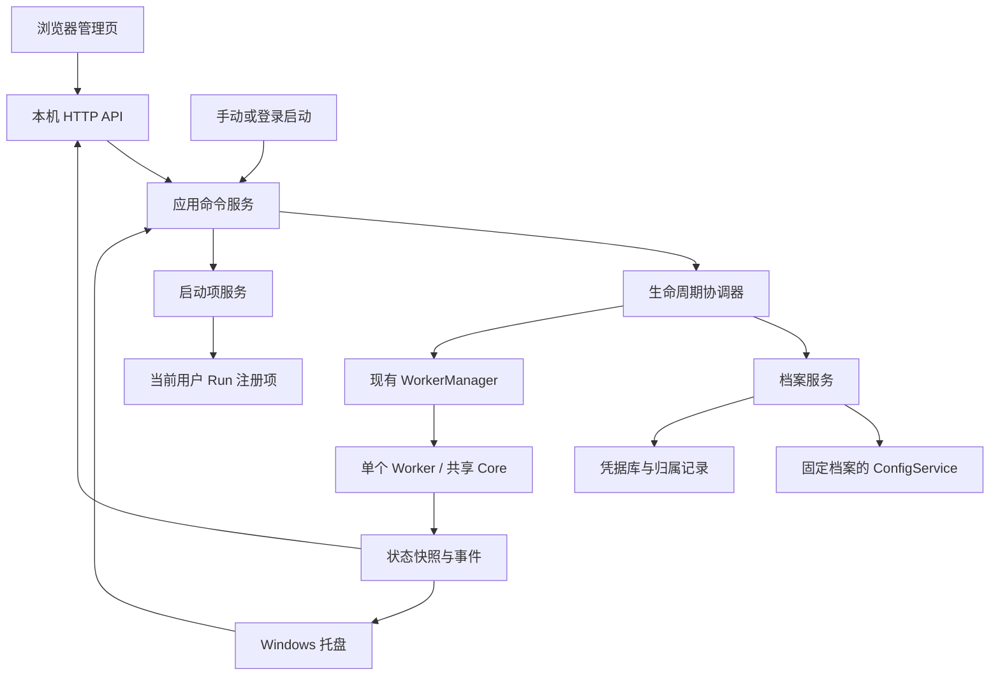

# Light 下一代：代码审查与桌面能力方案

日期：2026-09-26。审查基线：`main` / `9d7ad70`。状态：**方案草案，尚未实施**。

本文回答账号更换与删除、托盘运行、Windows 登录自启动的下一步设计。推荐沿用现有
Svelte 管理页、Python Controller、单 Worker 和共享 Core，发展为“可保存多个账号档案，
同一时刻运行一个账号”的桌面应用。先修复控制面缺陷，再扩展档案生命周期和 Windows 集成。

本文不改变现行合同；已实现行为以 [INTERFACES.md](INTERFACES.md)、
[DESIGN_DECISIONS.md](DESIGN_DECISIONS.md) 和 [Light 使用手册](../usage/LIGHT.md) 为准。
原 [Light 设计](LIGHT_EDITION_DESIGN.md) 的 L0–L5 是历史设计基线，不能将其中所有阶段描述
当作当前验收结论。本文的 N0–N5 是下一代阶段，不覆盖既有 L 编号。

## 1. 审查范围、方法与结论

本次检查 Light 入口、Controller、Worker 管理、配置/凭据/路径、HTTP API、状态聚合、
管理页源码、冻结与 staging 配置，并追踪共享 Core 的登录和账号锁。重点是桌面生命周期，
没有对完整版全部聊天、评论、MCP、记忆算法再做一轮完整审计。

方法：读调用链与 D-124–D-129、运行现有相关测试、增加不访问真实服务的审查探针。
开始时 Git 跟踪文件无未提交修改；部署 `config.yaml` 未读取其敏感内容，也未改动。

### 1.1 应保留的基础

| 已有能力 | 当前依据 | 下一代处理 |
|---|---|---|
| 页面关闭后后台继续运行 | `controller.py` 独立生命周期；浏览器不是 Worker 父进程 | 保留，增加可见的托盘入口 |
| Controller/Worker 隔离、Job 回收、双向分离管道 | `process_manager.py`、`platform/windows.py`、`worker_main.py` | 继续复用，避免另建一套启停逻辑 |
| 配置 revision、非敏感快照、凭据先写后引用 | `config_service.py`，D-127 | 扩展为显式档案上下文 |
| 系统凭据库及内存降级 | `credential_store.py`，D-126 | 保留；新增凭据归属和清理记录 |
| 本机会话、CSRF、Host/Origin 校验 | `session.py`、`api.py`，D-128 | 所有新 API 沿用；托盘直接调用应用服务 |
| 数据目录锁、站点稳定 ID 账号锁 | `raricy_bot/data_lock.py`、`BotApp.start()` | 保留；补删除标记检查和登录身份匹配 |
| 本地静态资源、独立发行闭包 | `frontend/`、`tools/build_light.py`、`packaging/light/` | 增加图标、版本和桌面流程验证 |

### 1.2 确认的功能缺口

1. **换账号未贯通。** `ConfigService.commit()` L587–594 禁止改变已有账号；
   `set_active_profile()` L408 仅是低层指针写入，停旧 Worker 的责任留给调用者。
   API 无档案列表、创建、切换、删除接口，页面也没有入口。
2. **账号删除未实现。** 既没有移除档案流程，也没有对历史凭据、SQLite、KB、记忆、归档的清理协调。
3. **后台运行已有，托盘未实现。** 入口和平台协议没有通知区域图标、菜单和消息循环。
4. **登录自启动未实现。** `start_bot_on_launch` 只是启动 Light 后是否启动机器人；
   没有向 Windows 注册启动项，也没有区分手动启动与登录启动的参数。
5. **档案身份未完整绑定。** 向导站点测试返回稳定 `account_id`，但正式档案主要保存账号名；
   稳定 ID 只被前端用于名单预填，没有形成持久、由服务端验证的档案身份合同。
6. **状态还只有 revision 维度。** `StatusService.TestResult`、启动目标和前端 DTO 未包含
   档案身份。A、B 都为 revision 1 时，不能靠现有版本号判断结果属于谁。
   这是开放切换前必须改造的基础，当前无切换 UI 时不单独归类为已发生的串号缺陷。

### 1.3 已复现的缺陷

#### F1 · P2：设置页“删除凭据”无法完成

- 入口：[Settings.svelte](../../frontend/src/Settings.svelte) L226–241 提供密码/模型 Key 删除选项。
- 原因：[config_service.py](../../src/raricy_launcher/config_service.py) L596–605 把删除转换为空字符串，
  随后 `_validate()` 要求账号、密码和模型 Key 齐全；尚未进入凭据持久化就拒绝。
- 离线 HTTP 探针：已保存 revision 1 后分别删除密码和 Key，均返回
  `422 credentials_required`，旧凭据仍可从内存替身读取。
- 影响：界面和使用手册承诺的删除操作不可用；用户不能通过页面撤回本机保存的秘密。
- 修复方向：将“配置结构有效”和“可启动”分开，提供独立凭据清除事务；删除后允许进入
  `needs_credentials`。清除旧版本引用的语义见 §6，不能只放松必填校验。

#### F2 · P2：活动档案元数据损坏会被当作首次运行并改写指针

- 入口：[config_service.py](../../src/raricy_launcher/config_service.py) L354–405。
- 原因：`read_launcher_metadata()` 将 YAML 解析错误返回为 `{}`；`active_profile()` 对坏指针
  返回 `None`；随后的 `require_profile()` 自动新建档案并覆盖元数据。
- 离线探针：在已有有效档案时把 `launcher.json` 改为无效语法，调用 `status()` 后得到
  `needs_setup`，活动 ID 已改变，旧档案文件仍在。
- 影响：实际数据没有被删除，但用户看到的是空向导，原始损坏证据也被覆盖；升级、自启动时更难诊断。
- 修复方向：仅“元数据不存在且没有既有档案”可以初始化；损坏、未知版本、非法/丢失指针、
  不可访问分别进入稳定恢复状态。查询不修复、不创建、不覆盖。

#### F3 · P2：站点测试与启动没有共享互斥门

- 入口：[api.py](../../src/raricy_launcher/api.py) L580–605 在开始测试前检查一次进程状态，
  随后把测试交给线程；L506–517 的启动接口没有检查在途站点测试。
- 离线探针：把站点测试替换成等待事件的函数，保持测试未结束，再请求启动，得到 `202`，
  管理器已收到启动调用。未访问站点，未声称已复现真实服务的登录互踢。
- 影响：两个页面或后续托盘命令能绕过“先停止再测试”的合同；两个站点测试也没有共用的互斥租约。
- 修复方向：站点测试、启动、重启、切换、删除共用服务层生命周期门；按钮禁用只是交互提示。

### 1.4 本次验证

| 检查 | 结果和边界 |
|---|---|
| `tests/test_launcher*.py` + `tests/test_build_light.py` | **182 passed，63.19 秒**；包含本机 Windows 平台测试和替身流程 |
| `frontend` 中 `npm run check` | **0 errors / 0 warnings** |
| `tests/review_light_next_probe.py` | F1 两种凭据、F2 元数据、F3 测试/启动交错均复现 |
| 本次未执行 | 完整版全套、重新冻结、冻结包冒烟、独立干净 Windows、真实账号/模型验收 |

最初测试命令的临时目录父路径未创建；修正后仍遇到沙箱的临时目录 ACL/命名管道限制。
最终结果来自获准在沙箱外重新执行的同一组本地测试，不将早期环境失败算作产品失败。
前端检查也在可加载 Vite 配置的环境中重跑。`tests/` 被 Git 忽略；审查探针是本地文件，
上述测试不能声称随干净克隆自动可用。

## 2. 产品范围与优先级

### 2.1 下一代的明确目标

以 Windows 11 x64 为首个完整验收平台；继续交付自包含 ZIP。其他 Windows 版本只有通过
对应矩阵后才列入支持范围。产品中的“开机启动”写成准确的“登录 Windows 时启动 Light”。

| 优先级 | 交付能力 | 完成后的用户行为 |
|---|---|---|
| 必须 | 当前三个缺陷修复 | 凭据可清除，损坏不丢档案入口，测试与启动不会并发越界 |
| 必须 | 账号档案管理 | 添加、查看、重命名本地标签、切换、移除、彻底清理 |
| 必须 | 托盘 | 看状态、打开管理页、启停、退出；Explorer 重启后恢复图标 |
| 必须 | 登录自启动 | 当前 Windows 用户主动开启，可关闭、检测路径失效、明确修复 |
| 必须 | 升级与恢复 | 接管现有单档案，不复制串用账号数据，迁移中断可恢复 |
| 后续 | 安装器、备份/恢复向导、历史凭据整理界面 | 稳定路径与更完整的数据管理 |
| 暂缓 | 多 Worker 并行、Windows 服务、自动更新、多平台重写 | 单独立项和验收 |

“删除账号”限定为本机 Light 档案和本机保存的凭据；不调用站点注销接口，不撤销已发送消息或评论。
本机删除不承诺磁盘安全擦除，也不能清理用户另存的备份。

### 2.2 架构选择

| 方案 | 收益 | 代价 | 结论 |
|---|---|---|---|
| 保留浏览器管理页，给 Controller 增加原生 Windows 托盘 | 复用现有代码、包体与进程隔离；不增加浏览器内核运行依赖 | 需要认真处理消息循环和异步命令 | **推荐** |
| 改为 WebView/原生窗口壳 | 设置窗口更像普通桌面应用 | 新运行时、打包与窗口生命周期；不自动解决账号事务 | 有明确窗口需求时再评估 |
| 多账号各运行一个 Worker | 同时在线多个机器人 | 配额、资源、状态、通知和退出复杂度显著增加 | 不纳入本轮 |

## 3. 模块边界与调用结构



建议新增下列模块；名字是设计建议，不表示已存在。

| 模块 | 责任 | 不应承担的工作 |
|---|---|---|
| `profile_service.py` | 列表、创建、身份绑定、激活指针、移除和恢复 | 直接操作 Worker 内部线程 |
| `lifecycle_service.py` | 命令串行化、操作记录、取消代次、启停/测试/切换协调 | 承担聊天业务 |
| `credential_lifecycle.py` | 引用归属、清除范围、重试与遗留引用清单 | 将凭据序列化到任务日志 |
| `desktop_settings.py` | 桌面偏好与独立 revision | 存储机器人业务配置 |
| `platform/tray_windows.py` | 隐藏窗口、托盘菜单、系统事件转发 | 从回调执行网络、keyring 或阻塞停止 |
| `platform/startup_windows.py` | 当前用户启动项的读取、注册、禁用、路径校验 | 修改其他应用启动项 |
| `migration.py` | v1 检查、备份、分阶段迁移、恢复 | 迁移时登录站点或启动机器人 |
| `frontend/Accounts.svelte`、`DesktopSettings.svelte` | 账号流程和桌面偏好 | 作为身份或权限判断的唯一来源 |

`Controller` 负责装配和全局退出。`LocalApi` 限定为认证、DTO 校验、调用服务和错误映射。
托盘、HTTP、启动入口调用同一组命令；托盘不需要生成 Cookie 或绕道向本机 HTTP 发请求。

## 4. 档案与身份模型

### 4.1 身份和目录

- `profile_id`：随机且不可变，只用于本地归属与路径；沿用现有合法 ID 校验。
- `site_user_id`：站点登录返回的稳定 ID，由服务端验证后绑定；账号名用于登录和显示。
- `display_name`：可修改的本地标签，不改变登录身份。用户名变化须重新验证且稳定 ID 相同。
- 一个站点稳定 ID 对应一个可用档案；重复添加时引导回已有档案，不复制 SQLite/记忆。
- `active_profile_id`、`running_profile_id`、`startup_profile_id` 分开表达，不能以“当前账号”混用。
- 同时仅一个 Worker。每个档案独立拥有配置、凭据引用、数据库、KB、记忆、日志和草稿。

推荐布局：

```text
RaricyBotLight/
  launcher.json              档案索引、活动指针、schema 与 catalog_revision
  desktop.json               桌面偏好、启动目标与 settings_revision
  operations/<id>.json       切换/删除/迁移的最小恢复记录
  credentials-index.json     引用归属与清理状态，无秘密取值
  runtime/                   当前实例信息
  diagnostics/               有界诊断
  profiles/<profile_id>/
    profile.json             稳定身份、生命周期状态与 profile_revision
    config.yaml / draft.yaml / revisions/ / runtime/
    data/ / knowledge/ / logs/
```

配置数据仍以 `config.yaml` 为主来源；索引只维护导航和归属，不复制完整模型/权限配置。
跨文件操作以恢复记录协调，不能假装多个 `os.replace` 是一个共同事务。
`ConfigService` 改为显式绑定 `profile_id`，一次请求内不反复从可变活动指针推导目录。
API 查询不得再隐式调用“创建首个档案”。

### 4.2 添加与更换

1. 从账号页选择“添加账号”，建立非活动的设置草稿；当前档案保持原指向。
2. 用户填写新账号。开始站点验证前明确提示需暂时停止当前机器人；取得全局操作租约并停稳。
   登录测试仍使用已有站点客户端，不增加站点 API 范围。
3. 后端返回一次性、短期的 `verification_id`，仅在内存中绑定会话、候选档案、
   精确的账号/密码输入和服务器取得的稳定 ID。保存时消费该验证记录；改密码/账号就失效。
   Controller 重启后必须重新验证，不把密码摘要写盘，也不信任前端自报的 `account_id`。
4. 填模型配置并测试。可以明确选择复制旧档案的模型参数、System Prompt；默认不复制密钥，
   不复制权限名单、SQLite、记忆、KB、评论开关或历史状态。
5. 为新账号预填本人稳定 ID 权限；用户确认后才开启相应能力。账号是否能聊天以探测结果为准。
6. 成功提交新档案后提供“保存”和“保存并切换启动”。取消/验证失败保留原活动指针，
   已停止的旧机器人由用户显式启动，避免悄悄恢复外部写入。

切换到已保存的 B 复用 §5 事务，不修改 A 的登录名或重用 A 的存储路径。
Worker 每次登录后、启动 SSE/评论/记忆前，将真实 `user.id` 与档案期望 ID 比较；
不匹配直接 `account_identity_mismatch` 并关闭资源。该检查由 Light 注入共享 Core 的可选
身份校验接缝，默认不影响完整版；不能只在 ready 上报后才检查，此时可能已开始消费消息。

## 5. 切换和并发控制

### 5.1 全局不变量

1. “停止”先提高取消代次，取消排队的启动/重启/切换后的启动；“退出”再永久关闭本次实例的启动入口。
2. 旧 Worker 退出必须由进程句柄确认；收到 stopped 帧、管道 EOF 或 `state=failed` 都不足以证明进程已回收。
3. 不持有配置锁或生命周期互斥锁等待 Worker、网络或 keyring；用短锁记录操作租约和不可变输入。
4. 不允许站点测试与启动、另一个站点测试、删除或切换同时持有租约。
   已保存模型测试可用不可变配置快照执行；涉及该档案的删除/凭据清除须等待或取消并确认测试结束。
5. 所有配置写入指定档案；所有影响活动 Worker 的命令带活动代次，旧页面不能启动新账号。
6. 身份键使用 `(profile_id, config_revision, profile_epoch)`；Worker 上报再加 `run_id`。
   测试结果、待重启提示、事件和状态不能只比较数字 revision。

### 5.2 A → B 的事务

```text
validate_target → reserve_operation → stop_A → confirm_A_exited
    → commit_active_B → invalidate_old_views → [start_B] → finished
```

请求固定 B 的 revision、目录与凭据版本；不能在后台启动线程中重新猜“最新活动档案”。
写入恢复记录后再执行关键副作用；操作是异步的，返回 `operation_id`，页面可看阶段。

| 故障/用户动作 | 确定结果 |
|---|---|
| B 不完整或凭据不可用 | 启动式切换在停 A 前拒绝；显式“只选中以修复”可选中但不启动 |
| A 无法确认退出 | 不切指针、不启动 B，保留失败操作与可诊断状态 |
| A 已退出，写活动指针失败 | A 仍为活动档案但停止；B 不启动 |
| 指针已提交，B 启动失败 | B 保持选中并显示失败；不自动回到 A 开始发消息 |
| stop 在切换期间到达 | 指针提交前取消则保留 A；提交后保留 B；两种情况都不再启动 Worker |
| quit 在任何阶段到达 | 取消后续启动，收回所有 Worker，保留足以恢复的记录 |
| 响应丢失/重复提交 | 相同幂等键和相同请求返回同一操作；相同键不同输入回 409 |
| Controller 崩溃 | Job 回收 Worker；重启按记录检查指针，不自动继续产生外部写入 |

托盘快捷切换只操作已配置档案；存在运行中账号时打开有明确启停说明的切换对话框。
后台线程的旧结果如身份键不匹配，只能归入旧操作，不能覆盖当前状态。

## 6. 移除账号、彻底删除与凭据清除

### 6.1 三种独立动作

| 动作 | 本机结果 | 可恢复性 |
|---|---|---|
| 清除保存的密码/模型 Key | 停止使用它的 Worker，清除该类秘密的受管历史版本；配置进入 `needs_credentials` | 重新输入并验证；不从旧快照自动恢复秘密 |
| 移除账号，保留本地数据（默认） | 清除该档案全部受管凭据，档案转为 `detached`，保留 KB、记忆、数据库等 | 重验相同稳定 ID 后重新绑定 |
| 删除账号及本地数据 | 清除全部受管凭据，以及该档案配置、草稿、快照、DB/WAL/SHM、KB、记忆与日志 | 不提供撤销；可从用户自己的备份恢复数据，但凭据要重填 |

每项都说明对已发站点内容没有影响。不要把“停止机器人”“清除密码”“移除账号”做成同一个按钮。

删除前先生成预览：档案标签、稳定 ID、数据类别和大小、是否运行、是否为自启动目标、
备份状态与未知凭据归属提醒。真正删除使用绑定档案 revision、范围和会话的短期确认令牌；
参数变化则重新预览。UI 需要明确二次确认，但后端也校验同一份操作范围。

### 6.2 删除的可恢复顺序

1. 校验预览令牌和所有 revision，写最小操作记录，状态转为 `deleting`，阻止新启动和新编辑。
2. 取消在途测试/启动，停 Worker 并确认退出，取得数据排他锁；其他进程占用则停止推进。
3. 如果它是启动目标，先清空目标并禁用该配置的机器人自动运行。
   如果它是活动档案，清空活动指针；不得自动选中并启动其他账号。
4. 清理前把已知凭据引用、归属和删除阶段写入恢复记录，再清除 keyring。
   每条独立记录成功/失败；后端暂时不可用显示 `credentials_cleanup_pending`，提供重试。
5. 根据用户选择清除业务数据或保留为 detached；恢复记录不能随档案内容一起删除。
6. 只有请求范围全部完成才显示成功。部分完成显示已清理和未清理的类别，重启后可幂等继续。

**删除路径的实现约束：** API 只接受档案 ID，不接受任意目录；破坏性操作逐层拒绝符号链接、
junction 和其他重解析点，解析失败直接拒绝，不能沿用“解析失败退回字符串路径”的宽松策略。
删除器校验目标严格位于受管档案根且不等于根；以目录句柄/文件身份约束遍历，防止检查后换链。
不跨卷递归、不跟随链接，不从用户提供的备份路径删除文件。

当前数据锁文件位于 `data/` 内。不能设计成“持锁后无条件重命名整个目录”，Windows 可能拒绝。
本轮建议在原路径内按清单清理，保留最小墓碑及锁文件目录；管理器隐藏已删除档案，
可在后续维护中处理空目录。墓碑不保留正文或秘密。共享入口在持数据锁后、开 Store 前拒绝
已删除档案；相关 CLI 兼容测试必做。旧版本程序不认识新墓碑，升级/删除期间禁止并行运行旧版本，
不能宣传对任意旧 CLI 的保护。

### 6.3 历史凭据是本轮必须处理的债务

当前替换凭据会生成新引用，旧引用为运行版本和快照保留，见 D-127。
新版本的 `credentials-index` 必须在写 keyring **之前**登记待创建引用，成功提交后标记归属；
崩溃重启才能找回“写过但尚未引用”的条目。恢复记录不能包含密码或 Key。

迁移时收集正式配置、所有历史快照及可归属记录中的引用；删除不能只处理当前那一条。
旧版本可能已有完全失去引用的 keyring 条目，当前接口没有足够信息证明它们属于哪一档案。
对此列为“历史凭据归属未知”，保留人工清理说明，不批量删除整个 `RaricyBotLight` 服务命名空间。

清除单一凭据时，现有载荷把密码和模型 Key 放在同一对象里：需为保留的一项写新引用，
将旧的受管引用全部撤销，再提交相应的 `needs_credentials` 状态。部分失败则保持不可启动、
记录清理待办；不可因已有旧快照就重新获取用户要求清除的密码。无需本轮强行拆成全局共享 Key。

## 7. 托盘运行

### 7.1 用户交互

菜单按状态启用：

- 打开管理页；双击图标执行同一动作。
- 当前账号标签和状态：未设置、已停止、启动中、运行中、连接异常、正在退出。
- 启动 / 停止 / 重启；切换账号入口。
- 登录启动设置；打开诊断目录。
- 退出 Light：收回 Worker、移除图标、关闭 Controller。

正常运行、已停止、需处理三类图标配合文字使用，不单靠颜色。托盘“运行中”只代表进程运行，
tooltip 可显示站点连接或降级信息；无新鲜上报显示未知/过期。通知只在需重新填凭据、启动失败、
异常退出、清理失败等可行动变化时触发，同一运行的一类错误去重。
默认不在桌面通知暴露账号 ID、聊天正文、模型内容或原始异常。

### 7.2 Windows 实现

推荐复用现有 `pywin32`，通过 `Shell_NotifyIcon` 与本地 `.ico` 资源实现，避免为托盘引入完整 GUI 栈。
Microsoft 的 [任务栏文档](https://learn.microsoft.com/en-us/windows/win32/shell/taskbar)
说明了通知区域图标的添加，以及 Explorer 重建任务栏后的 `TaskbarCreated` 通知。

- 主线程持有隐藏顶层窗口和消息循环，也持有单实例守卫；使用能接收广播的窗口，
  不依赖无法收到相关广播的纯消息窗口。
- 初始化和每次重新添加图标后设置相应通知版本；资源从冻结包读取，包含高 DPI 尺寸。
- 窗口回调只投递结构化命令；服务完成后发回状态事件，再由窗口所属线程更新图标。
- Explorer 重启时重建图标与菜单，保持 Controller/Worker 原样；窗口线程退出不能遗留 Worker。
- 托盘初始化失败：手动启动打开管理页并显示诊断；登录启动也必须提供一次可见的修复入口，
  不能让用户进入没有托盘且找不到控制入口的静默运行状态。
- 主线程继续处理消息，耗时启停放到协调器。最终释放守卫、窗口和图标在拥有它们的线程完成。

### 7.3 系统事件

普通“退出 Light”继续优雅停止和 Job 兜底。注销/关机只给予有界收尾，不能无限阻止系统关机，
也不能把被系统终止描述为优雅完成。实现时核对 `WM_QUERYENDSESSION`/`WM_ENDSESSION` 合同。
睡眠前不声明机器人持续在线；恢复时先将状态标为等待新上报，沿用已有 Core 的连接恢复能力。
本轮不新增“Worker 崩溃无限自动重启”；显式 stop/quit 永远不会被恢复策略覆盖。

## 8. Windows 登录自启动

### 8.1 设置含义

桌面设置维护三项：

1. `launch_at_sign_in`：登录当前 Windows 用户后启动 Light，默认关闭。
2. `start_bot_on_launch`：Light 新实例启动后是否启动选定机器人；与第一项独立。
3. `startup_profile_id`：明确的启动档案；切换账号不自动改变它。

`start_bot_on_launch` 在新版本以 `desktop.json` 为唯一来源，迁移后不再从每个档案读取同名偏好。
新实例自动运行前，按切换事务把选中指针设为启动目标并发布新上下文；不能让页面显示 A 而后台自动运行 B。
默认手动双击打开管理页；登录启动默认只进托盘。有缺失凭据或配置损坏时，登录启动保留托盘
并显示需处理提示，不反复弹浏览器。无任何账号时首次手动启动打开向导。
用户“启动机器人”的桌面菜单动作使用当前选中档案；自动启动只使用明确的启动目标。

| 场景 | 结果 |
|---|---|
| 手动首次启动 | 创建 Controller/托盘并打开管理页；按独立机器人启动偏好处理目标 |
| 已有实例，再次双击 | 只激活现有页面；不重复创建 Worker |
| `--startup` 且已有实例 | 安静退出该次入口；不打开页面、不恢复手动停止状态 |
| 登录启动但凭据仅在旧进程内存 | `needs_credentials`，不尝试运行，不循环登录 |
| 自动启动目标被移除 | 清空目标、关闭机器人自动启动偏好；保留用户自己的 Light 登录启动选择 |
| 用户在本次会话停止机器人 | 重复入口、网络恢复、托盘刷新不改变停止意图 |
| 用户退出 Light | 当前会话不自动复活；保留的登录启动设置在下次登录生效 |

`--startup` 是来源提示，不是权限边界；仍须重新读取授权偏好、档案状态和恢复记录。
已有实例的静默去重不能沿用当前只会 `open_admin` 的激活分支。

### 8.2 注册方式

首轮推荐当前用户的 `HKCU\Software\Microsoft\Windows\CurrentVersion\Run`，
仅维护 `RaricyBotLight` 自有值。命令为引号包围的已校验绝对 EXE 路径加固定 `--startup`，
不拼接用户名、账号 ID、密码或任意附加 shell 参数。只在已验证的冻结发行形态启用。
不用管理员权限，不建立 Windows 服务；任务计划程序的更多条件暂不引入。

Microsoft 的 [Run/RunOnce 文档](https://learn.microsoft.com/en-us/windows/win32/setupapi/run-and-runonce-registry-keys)
规定其在用户登录时触发，并指出执行可能延迟、顺序无保证，命令行有 260 字符上限。
实现须在写入前检查长度，超限时引导调整安装位置，不能悄悄截断。

注册服务返回分离事实：`requested_enabled`、`registration_present`、`command_matches`、
`executable_exists`、`last_apply_result`。无法通过受支持方式确认系统是否会实际执行时显示
`effective_state=unknown`，不能仅因注册表里有值就宣称“下次必定启动”。
不要写未文档化的 `StartupApproved` 二进制值，也不要覆盖用户在系统设置里的禁用决定。

### 8.3 路径、权限与恢复

- ZIP 用户先把整个应用目录放到长期路径，再开启；检测当前 EXE 和注册路径是否匹配。
- 应用目录搬动后，新程序提示“启动路径需修复”；由用户点击修复，不静默重写系统偏好。
- 同名注册值内容无法确认为本产品持有时，报告冲突，不覆盖未知命令。
- 设置文件与注册表不能一起原子提交：保存带 revision 的应用意图及待应用操作，执行后回读，
  最后记录实际结果。中断后在管理页显示差异并提供重试。
- 关闭功能只删除本产品持有的值，回读确认；策略拒绝/权限错误保持为失败状态，不假报关闭成功。
- 手动卸载先关闭登录启动；后续安装器在普通卸载时清理启动项，默认保留用户数据和凭据。

## 9. API、DTO 与前端变化

新增接口均要求现有会话；写入继续检查 CSRF、精确 Host/Origin、请求大小和严格字段白名单。
破坏性或长操作返回 `202 + operation_id`。接口名称供实施时细化，但含义应保持一致。

| 接口 | 意图 | 并发/身份要求 |
|---|---|---|
| `GET /api/profiles` | 档案列表、选中/运行/启动目标、可行动状态 | 无隐式创建 |
| `POST /api/profiles` | 创建待设置档案 | `expected_catalog_revision`、幂等键 |
| `POST /api/profiles/{id}/verify` | 验证身份，返回内存验证票据 | 测试租约、账号输入上限 |
| `PUT /api/profiles/{id}/config` | 保存目标档案 | 档案/config revision；首次绑定须验证票据 |
| `POST /api/profiles/{id}/activate` | 选中，或停旧后启动目标 | catalog revision、active epoch、目标 revision |
| `POST /api/profiles/{id}/removal-preview` | 返回删除类别与确认令牌 | scope、profile revision，不做删除 |
| `POST /api/profiles/{id}/remove` | 保留数据移除或彻底清理 | 确认令牌、幂等键、生命周期租约 |
| `POST /api/profiles/{id}/credentials/clear` | 清除指定秘密类别 | 确认范围；停止消费并清受管历史引用 |
| `GET/PUT /api/desktop-settings` | 桌面偏好 | 独立 settings revision |
| `GET /api/desktop/startup-status` | 期望与实际注册状态 | 不读取并返回任意其他启动项 |
| `POST /api/desktop/startup-repair` | 修复本产品失效路径 | 明确意图和 revision，不接受任意执行命令 |

现有 `/api/config`、`/api/bot/*` 若保留过渡入口，写请求也必须带明确档案和活动代次；
旧客户端缺少上下文时返回 `client_upgrade_required`，不能透明转发到刚切换的账号。
API 版本与配置 schema、IPC 协议版本分别维护；只有 IPC 信封/载荷合同变化才提升 IPC 版本。

状态 DTO 新增 `active_profile_id`、`running_profile_id`、`startup_profile_id`、`profile_epoch`、
`pending_operation`；测试结果带 profile/config revision。事件分别标明全局或档案归属，
前端默认只展示当前档案事件；切换时清理旧表单、密码输入、测试结果和待提交动作。
所有异步响应先核对上下文，再更新页面。

管理页建议四个主区：**概览、账号、当前账号设置、桌面设置**，近期事件保留入口。
账号卡片展示标签、账号名、稳定 ID、选中/运行/启动标记和清理待办。
首次设置复用向导；已有档案恢复、身份不匹配、缺失凭据要使用不同提示，不再全部退回空向导。
增加统一前端文案模块；后端固定消息仍放 `texts.py`，不继续在新组件里散布错误码翻译。

## 10. v1 迁移、升级和回退

1. 获取现有单实例守卫，任何迁移开始前停稳 Worker。确认根路径、现有 schema、档案指针和可读性。
2. 在写入前保存完整的非敏感配置/元数据备份并生成清单；涉及数据格式变化才要求停机整档案备份。
   系统凭据不导出，迁移备份也不能包含明文秘密。
3. 正常单档案保持原 `profile_id` 和数据目录；导入现有配置 revision、标签、引用和启动机器人偏好。
   Windows 登录启动默认关闭，不能由旧 `start_bot_on_launch=true` 推导为获准注册系统启动项。
4. 旧档案稳定 ID 未绑定，标记 `identity_unverified`，在第一次新版本运行前通过受控登录验证；
   不能把 memory 管理员名单当作机器人身份。迁移本身完全离线、不自动登录。
5. 元数据损坏或孤立目录转为恢复候选；不选“最新修改目录”自动接管，不合并同名目录。
6. 每步记录准备/完成状态，可重复执行。提交新索引后进入新版本；中断时根据阶段恢复，
   不把半迁移根目录当作干净安装。
7. 档案配置采用能让旧读取器拒绝的新版 schema；明确最低可读/可写版本。
   旧 Launcher 的根元数据校验很弱，不能仅加一个 `min_version` 字段就声称旧程序绝不会误写。
8. 回退须退出新程序，恢复升级前完整且一致的必要文件，并重新填写失效凭据；
   删除/清除凭据是不可逆副作用，配置回退不能恢复它们。禁止直接把旧 EXE 指向半迁移数据尝试修复。

迁移和删除的操作记录只保存 ID、revision、固定阶段码、受管相对路径与凭据引用；
不保存聊天、System Prompt、KB/记忆正文、密码或原始异常。已完成记录按有界策略清理，
未完成清理任务不能随普通日志轮转丢失。

## 11. 实施阶段与交付门槛

| 阶段 | 范围与主要文件 | 必须证明的结果 |
|---|---|---|
| N0：修复与版本边界 | `config_service.py`、`api.py`、相关页面；将审查探针转成回归测试 | 修复 F2/F3；F1 先移除无效删除承诺和入口，完整清除在 N2 交付；坏元数据绝不被读取覆盖 |
| N1：档案基础 | `profile_service.py`、固定档案 ConfigService、状态 DTO、`migration.py`、身份校验接缝 | v1 无损接管；同号 revision 不串档案；身份不符在消费前阻断 |
| N2：账号完整流程 | 生命周期协调器、凭据生命周期、Accounts 页面、新 API | A→B 不并行；停止意图优先；两种删除模式和部分清理可恢复 |
| N3：托盘 | 原生窗口平台适配、Controller 入口、图标、冻结配置 | 无浏览器仍可启停退出；Explorer 重启恢复；无孤儿 Worker |
| N4：登录启动 | 参数解析、启动项服务、桌面设置 | 不要求管理员；双启动去重；关掉/搬目录/系统禁用状态如实显示 |
| N5：发行验收 | 测试交付、重新冻结、smoke 工具、使用和升级文档 | 独立干净 Windows 全流程、升级/回退、长时间运行、授权真实服务验证 |

依赖顺序：N0 → N1 → N2；N3 依赖 N0 的统一命令边界，集成后再做 N4；N5 验证最终组合。
每阶段都可在其边界内单独审查，但面向普通用户的下一代发行应在 N0–N5 必要门槛满足后发布。
这不是只增加三个开关的局部修改；核心工作量在档案事务、跨入口并发和失败恢复。
具体工期应在 N1/N3 原型实测后估算，本文不以未验证的天数替代验收。

后续实施同步 INTERFACES §58–60，新增生效 D 条目，更新 Light 使用手册与配置/升级说明；
保持现有编号、原站方材料和完整版部署入口。方案实施完成后按归档规则归档本文，
仍未完成的平台或真实服务验收转入使用手册，不能随设计一起隐藏。

## 12. 测试与发行矩阵

| 层级 | 必测场景 | 通过标准 |
|---|---|---|
| 事务/单元 | 并发保存、相同 revision 跨档案、缺凭据、坏 schema、元数据缺失/损坏、引用回读失败 | 稳定错误、旧完整状态或可恢复中间态，无秘密输出 |
| 生命周期 | start/test 竞态；切换各阶段 stop/quit；重复点击；旧事件迟到；两个页面修改 | 单 Worker，身份一致，停止后不被旧任务拉起 |
| 账号/隐私 | 添加 B、同账号别名、稳定 ID 变化、切回 A、权限名单未串用 | B 不读 A 数据；账号不匹配在 SSE/评论/记忆前失败 |
| 删除/凭据 | 运行中删除、只清密码、只清 Key、历史快照、keyring 锁定、磁盘满、断电、文件占用 | 逐项完成、未知归属如实列出、部分失败可重试、被清秘密不会回退恢复 |
| 文件安全 | profile/子目录 junction、符号链接、遍历中替换、长路径、中文空格、目录不可写 | 拒绝越界，范围外哨兵文件保持原样 |
| 桌面 | 无标准流、首次启动、托盘菜单、Explorer 重启、高 DPI、注销、睡眠恢复、浏览器启动失败 | 控制入口可恢复，状态真实，无孤儿/重复进程 |
| 自启动 | 正常注册/删除、拒绝写入、路径移动、过长命令、系统关闭启动项、同时手动双击 | 偏好与实际分离、不覆盖系统决定、不重新启动已停止账号 |
| 迁移 | v1 单档案、坏指针、孤立目录、内存凭据、迁移各阶段崩溃、旧程序误启动 | 无静默新建、无自动外部写入、版本不兼容可诊断 |
| 发行 | staging 依赖闭包、图标/静态资源、冻结程序真实管道与托盘、ZIP 校验和 | 使用实际产物验证，不能由源码测试代替 |
| 长时间运行 | 建议至少 24 小时常驻、反复切换/启停、网络断续、慢事件消费者 | 内存/句柄/线程无持续增长，操作记录和日志有界 |

自动化继续使用 `MockTransport`、临时目录、内存/故障凭据替身、可注入时钟和 fake Worker。
Windows 系统集成用独立测试用户或 VM；测试只创建带唯一测试名的启动值并在 finally 中清理，
不修改开发者真实启动项，不停止开发者 Explorer。真实注销、重启和 Explorer 重建在测试 VM 验收。

N5 要区分四份证据：代码回归、开发机冻结冒烟、无 Python/Node/Docker 的干净 Windows、
已授权真实站点/模型。真实验证须明确账号、可发送的消息/评论范围和模型费用，不由离线测试推导成功。
不擅自改变当前 `tests/` 忽略策略；发行时提供版本绑定、带校验和的测试包或经批准纳入 CI 的测试源，
缺少该输入直接阻断“可复现验收”的结论。

## 13. 建议的完成定义

下一代可以宣称完成，至少要由同一发行包演示：

1. 现有 v1 用户升级后仍能找到原配置与数据，缺失凭据和损坏档案有明确恢复入口。
2. 用户添加 B、从 A 切换到 B、再切回 A，各自的 KB/记忆/数据库没有混用。
3. 用户清除凭据或移除账号后，旧 Worker 和旧配置版本不会继续使用已撤回的秘密。
4. 删除数据发生失败能看到清理进度，重启后继续，不谎报彻底删除。
5. 关闭所有浏览器仍可从托盘看状态、启停和退出；完全退出没有可继续写入的孤儿 Worker。
6. 用户主动开启登录启动后，在真实重新登录中生效；关闭后不再启动；重复入口不覆盖停止意图。
7. 同时保留既有的消息去重、配额、历史提交、记忆隐私和日志脱敏边界。

**推荐立项顺序：先补控制面和档案生命周期，再接托盘，最后开放登录自启动。**
这样自动运行的对象、凭据来源、停止意图和删除结果都有确定定义，后台能力才能可靠交付。
